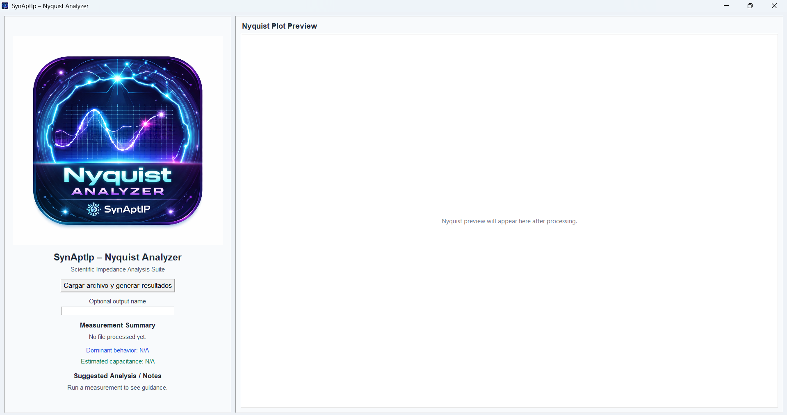

# SynAptIp Nyquist Analyzer

Scientific impedance analysis software for Nyquist and Bode visualization using LCR data.

Version: v1.0.1
Author: Daniel Ramírez Martínez
Organization: SynAptIp Technologies
DOI: https://doi.org/10.5281/zenodo.19105599
Repository: https://github.com/Tecnodram/synaptip-nyquist-analyzer

---

   

<em>SynAptIp Nyquist Analyzer - Scientific Impedance Visualization Interface</em>

---

## Description

SynAptIp Nyquist Analyzer is a scientific impedance analysis tool designed to process LCR meter CSV data and generate publication-ready Nyquist and Bode plots. It is available as both a lightweight standalone executable and a Python-based application for reproducible analytical workflows.

The software is built for researchers and engineers who require fast and clear impedance visualization for exploratory analysis, experimental validation, and reporting.

---

## Features

- Nyquist plot generation
- Bode plots (magnitude and phase)
- Automatic parsing of LCR output files
- Scientific-style visualization
- PNG-based preview rendering
- Local execution (.exe support)
- Clean and minimal interface

---

## Usage

### Run from executable

- Download the latest release package from the Releases section.
- Run the executable directly.

### Run from source

1. Install dependencies:

   pip install -r requirements.txt

2. Launch the application:

   python nyquist_app.py

---

## Build

To build the Windows executable from source:

pyinstaller --clean --name "SynAptIp Nyquist Analyzer v1.0.1" --onefile --windowed --icon assets/SynAptIp-Nyquist.ico --add-data "assets/SynAptIp-Nyquist.png;assets" nyquist_app.py

---

## Scientific Context

Impedance spectroscopy is a core method for characterizing frequency-dependent electrical behavior in materials, devices, and electrochemical systems. Nyquist and Bode representations provide complementary views of resistive and reactive responses, supporting model selection and parameter interpretation.

SynAptIp Nyquist Analyzer supports practical analysis workflows for RC circuits and material characterization studies, including use cases in electrochemical and electronic evaluation. The tool is intended to streamline experimental validation workflows by providing rapid visual feedback and standardized plot outputs.

---

## How to Cite

Ramírez Martínez, D. (2026). *SynAptIp Nyquist Analyzer (Version 1.0.1)* [Computer software]. SynAptIp Technologies.
https://doi.org/10.5281/zenodo.19105599

BibTeX:

    @software{ramirez2026synaptip,
      author = {Ramírez Martínez, Daniel},
      title = {SynAptIp Nyquist Analyzer},
      version = {1.0.1},
      year = {2026},
      organization = {SynAptIp Technologies},
      doi = {10.5281/zenodo.19105599}
    }

---

## License

All rights reserved.
This software is proprietary. Commercial use requires permission from the author.

---

## Disclaimer

This software was developed independently by the author and is not affiliated with any laboratory, institution, or organization where testing or validation may have occurred.

All data used for demonstration and validation is generic and does not represent proprietary or institutional datasets.

---

## About SynAptIp Technologies

SynAptIp Technologies is an emerging innovation lab focused on:

- Artificial Intelligence
- Scientific Software Development
- Environmental Data Science
- Hardware + Software Integration
- Sustainability-driven technology

---

## Author

Daniel Ramírez Martínez
Founder — SynAptIp Technologies

---

## Roadmap

- Advanced impedance modeling
- ZView/Gamry-like interface
- Automated parameter fitting
- Batch processing
- Scientific reporting tools
